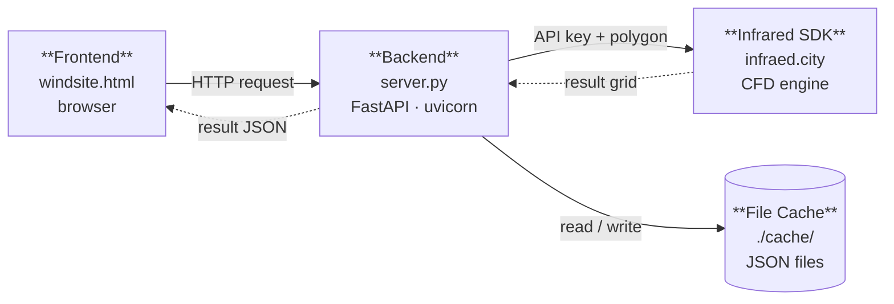
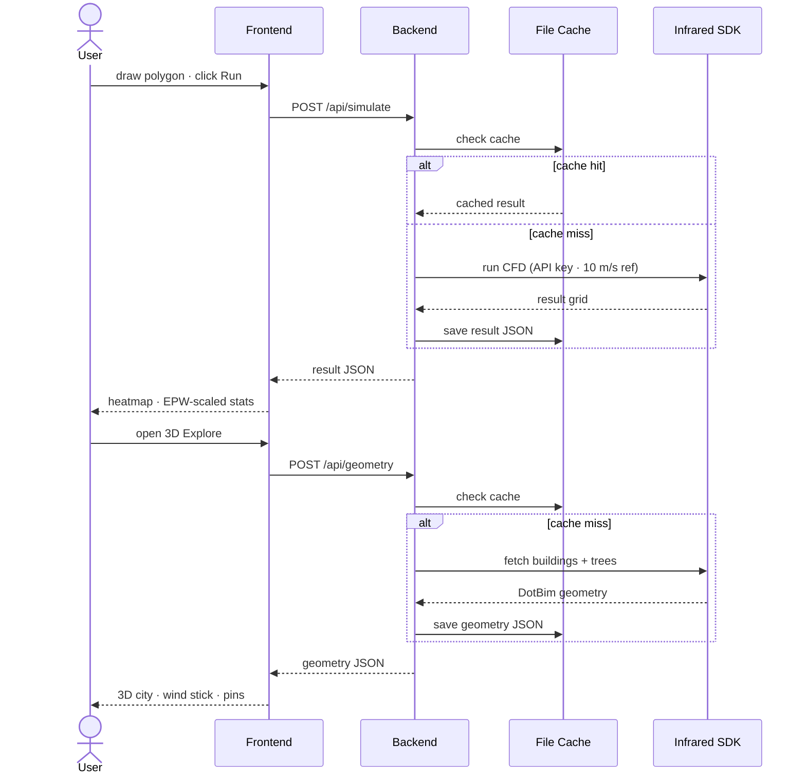
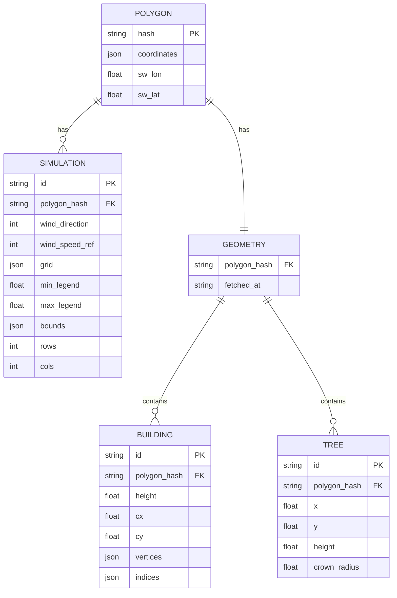
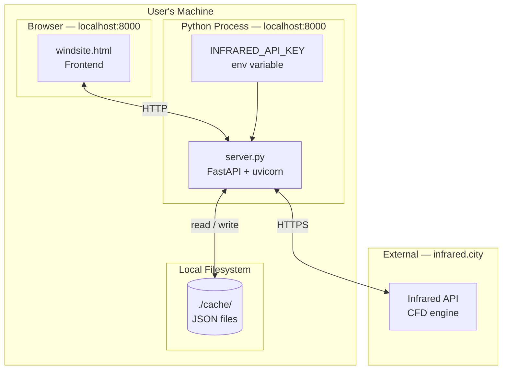

# WindSite — Architecture Diagrams
# Paste each Mermaid block into Miro → Apps → Mermaid

---

## DIAGRAM 1 · COMPONENT — What are the parts?

---

## DIAGRAM 2 · SEQUENCE — What happens, in what order?

---

## DIAGRAM 3 · ENTITY-RELATIONSHIP — What data, and how is it related?

---

## DIAGRAM 4 · DEPLOYMENT — Where does each part run?

